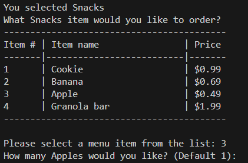
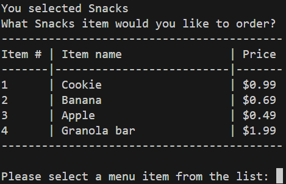
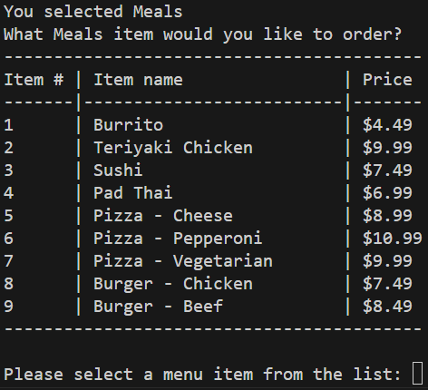
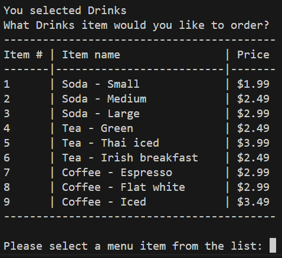
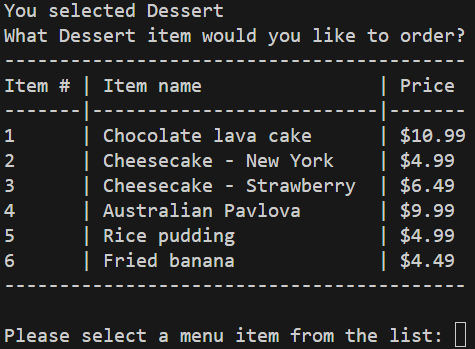
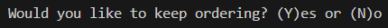
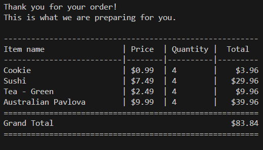

# Python Challenge 1

## The Challenge
The challenge posed in the very first Python assignment was to present a preset menu from a food truck to the customer, take their orders, and print out a receipt for the items they have ordered.

Accordingly, we have been provided a menu to use for our food trucks and provided instructions on what is expected of us.

## Code and results

Upon running the code, a menu selection screen is displayed from the menu we have been provided with, followed by a request for a menu number selection.

Selecting each menu item generates a different menus with item numbers for each item that can be ordered along with their prices.

### Snacks Menu

### Meals Menu

### Drinks Menu

### Dessert Menu

A selection is made from the list using the item number listed on left of the item followed by the quantity of the item they would like to order. The quantity defaults to 1 unless a valid higher number is input.

The customer is then posed the question whether they would like to continue ordering, yes or no.

If the customer opts to continue ordering items, they are taken back to the menu selection list. Otherwise, they are thanked for their order and a receipt is provided with the items they have selected to order along with a line item total and a grand total and the program exits.

### Invalid inputs

The programs checks for 2 kinds of invalid inputs:
1. numeric inputs not on menu list
2. non numeric inputs

In both cases, the customer is displayed a message then taken back to the selection screen.

## Default inputs

When entering the quantity of a selected menu item, unless a number greater than 1 is entered, the quantity defaults to 1.